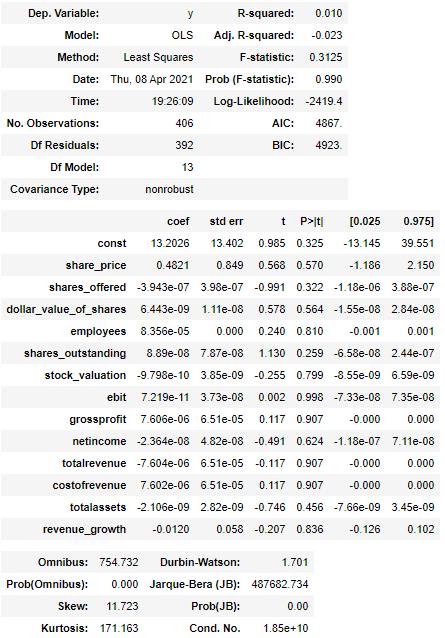
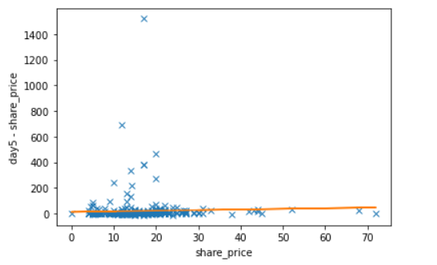
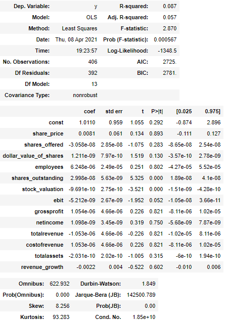
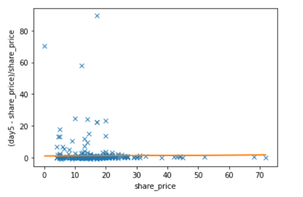

## IPO ML Project Midterm Report

### Team Members

Jun Chen

Joshua Hess

Zhening Xu

Owen Reece

Hunter Germundsen

[Link to Project Proposal](https://ipo-project-ml-2021.github.io/)

# Introduction/Background

For day traders and stock brokers, one of the most intriguing investments are companies selling their stock publicly for the first time (IPO, or Initial Public Offering). Because these stocks are new, and the companies relatively unproven, IPO stocks are much more volatile than stocks for established companies. With the “extraordinarily high variability of initial returns” [1] there is increased opportunity alongside this increased risk; using machine learning techniques we will try to best capitalize on this volatility by predicting whether an IPO stock will increase or decrease in the first 5 business days of trading.

# Problem Definition

With the controversy surrounding Wall Street and the stock market spiking recently, companies have more reason than ever to be fearful of going public. We seek to create a program that predicts the change-in-price of an IPO after its first week on the market by leveraging historical market data, with the intent of assisting smaller companies in determining if going public is the right move for them.

# Data Collection

Part 1 Data Collection:

We retrieved our IPO  data using Selenium and BeautifulSoup.  We used a Firefox webdriver to scrape IPO dates and which companies and their prices from [NASDAQ’s IPO Calendar](https://www.nasdaq.com/market-activity/ipos?tab=upcoming). During this first process, there were timeout errors which caused Selenium Timeout errors  and StaleElementException in our program which we used an iterative point algorithm which we kept a list of error months and years and keep iterating through these months and years until there is no error. We also scraped the link to each company on this Nasdaq website to go to a secondary site that has more information about the company. [For example](https://www.nasdaq.com/market-activity/ipos/overview?dealId=1062699-96407), Applovin’s company page on the Nasdaq website provided by the href of the <a\> tag on the IPO Calendar. We scrape from the year January 2009 to December 2020. Within that 11 year span, we have an initial collection of around 1557 companies with features of ticker, exchange, share price, shares offered, dollar value of shares, and date of the IPO priced. Some companies have  After that we use the company link provided by Nasdaq and scrape that page for the number of employees, shares_outstanding,stock_valuation,company_address, and phone. Companies with less than 10 employees were dropped from the dataset to take out SPAC companies (blank check companies that don't have business and are for the purpose of merging a private company and bringing that company to the public). We are going back and looking through these 1557 companies to add the ones that are not SPAC. After this process, there were 1083 companies left in the data frame. The next process is fetching the ebit (earnings before interest and tax), gross profit (company's profit before interest and taxes), net income (sales minus cost of goods sold), total revenue (total sales of goods and services), cost revenue (total cost of manufacturing and delivering a product), total assets (total economic value owned by the company), revenue_growth (one year annual revenue compared to the previous year revenue) which we use the edgar-online.com api using https://datafied.api.edgar-online.com/v2/corefinancials/ann?primarysymbols=etsy&numperiods=10&appkey=<appkey\>. A number of companies were not in the database thus they were omitted in this step which left the number of companies to 449. Another scenario was parsing straight from the SEC database which has pdf files in html format which is still under development. The last step is using the Selenium and BeautifulSoup to get the first five day closing price from Marketwatch.com from the initial IPO date [here](https://www.marketwatch.com/investing/stock/zvo/download-data?startDate=04/15/2009&endDate=04/19/2009). While scraping this data some companies don’t have a table of their historical stock price which was null or 0 as the share prices for the five days. After this step, we move on to part 2 of the Data Cleaning.

Code Explanation for Data Collection Files:

    Data Collect Step 1:
        data_collection.py: uses Selenium and BeautifulSoup to Scrape Nasdaq
        data_collect_error_years.py: Iterate through the error years based on the csv filename. (Run this file until no error)
    
    Data Collect Step 2:
        data_processing_part2.py: Processing for the Company Page Information

    Data Collect Step 3:
        Soneprocess.py: Get the ebit, gross profit, net income, total revenue, total assets from edgar-online.com api
    
    Data Collect Step 4:
        getfivedayprices.py : Get Five Day Prices from Marketwatch
        

Part 2 Data Cleaning:

Of the 450 companies, 44 were missing share price for day 5 and we simply removed these companies resulting in a dataset of 406 companies. For the numeric data, we also converted the datatypes from strings to floats.

# Methods

Select important features:
1. Manual Selection: Of the 27 original features we determined that 7 features did not have data relevant to our prediction. These features were:

Column Name | Description
----------  | ----------
“exchange”  | The exchange on which the stock was traded (ex = NYSE)
“href”      | Url to an overview of the ipo
“company_address” | Physical address of company’s headquarters
“phone” | Companies public phone-number
“company_name”  | String of company’s legal name
“Unnamed: 0”  | Index column
“ticker”  | Ticker symbol for stock (ex = H for Hyatt Hotels Corp)

2. Forward selection: This is based on Linear Regression to select features by a significance level less than 0.05, which indicates they are of statistical significance during model building. Forward selection selects the features one after another by their significance level in the linear regression model. 
 
3. Backward elimination: This is based on Linear Regression to select features by a significance level less than 0.05, which indicates they are of statistical significance during model building. Backward elimination eliminates the features that  have low significance level ($\leq 0.05$)

Predictive Models:
1. Linear Regression Model: Using the 13 features described in the “discussion” section we used the OLS function from statsmodels.api to perform our linear regression model.

# Results

Using data from previous days:

    Features selected by forward selection for day 1: ['share_price']
    Features selected by forward selection for day 2: ['1']
    Features selected by forward selection for day 3: ['2', '1', 'share_price', 'dollar_value_of_shares']
    Features selected by forward selection for day 4: ['1', '3', '2']
    Features selected by forward selection for day 5: ['1', '4', '2', '3']

Not using data from previous days:

    Features selected by forward selection for day 1: ['share_price']
    Features selected by forward selection for day 2: []
    Features selected by forward selection for day 3: ['share_price']
    Features selected by forward selection for day 4: ['share_price']
    Features selected by forward selection for day 5: ['share_price']

Using data from previous days:

    Features selected by backward elimination for day 1: ['share_price']
    Features selected by backward elimination for day 2: ['1' 'netincome' 'dollar_value_of_shares' 'shares_outstanding'
      'shares_offered' 'share_price' 'totalassets' 'costofrevenue' 'stock_valuation' 'employees' 'totalrevenue' 'ebit']
    Features selected by backward elimination for day 3: ['2' '1' 'share_price' 'dollar_value_of_shares']
    Features selected by backward elimination for day 4: ['3' '1' '2']
    Features selected by backward elimination for day 5: ['4' '1' '2' '3' 'shares_outstanding' 'dollar_value_of_shares'
      'totalassets']

Not using data from previous day:

    Features selected by backward elimination for day 1: ['share_price']
    Features selected by backward elimination for day 2: ['share_price']
    Features selected by backward elimination for day 3: ['share_price']
    Features selected by backward elimination for day 4: ['share_price']
    Features selected by backward elimination for day 5: ['share_price']

Target = day5 - share_price

Target = (day5 - share_price) / share_price

# Discussion

After our feature analysis, we decided to use the following 13 features, all of which are numeric:

Column Name | Description
----------  | ------------
“share_price” | Initial price of stock in USD
“shares_offered” | Number of shares initially available for purchase
“dollar_value_of_shares” | Market cap available for purchase (share_price * shares_offered)
“employees” | Number of employees working for company at IPO date
“shares_outstanding” | Total number of shares (privately owned and available for purchase)
“stock_valuation” | Total market cap
“ebit” | Earnings Before Interest and Tax
“grossprofit” | Gross profit during the previous financial year
“netincome” | Net income during the previous financial year
“totalrevenue” | Total revenue during the previous financial year 
“costofrevenue” | Costs incurred during the producing, marketing, and distributing of products/services in the previous financial year
“totalassets” | Liabilities + Equity
“revenue_growth” | Growth in revenue experienced during the previous financial year

Currently we have created a linear regression model for predicting (day5 - share_price) / share_price and in the future we plan on performing a polynomial regression model as well as random forest classifier. 

Looking at our plot we can also see there may be some issues with outliers. If we find that these outliers are an issue, we will most likely use the standard method of outlier removal where you ignore points outside of mean +- 1.5 * IQR. (interquartile range).

# References

[1] M. Lowry, M. S. Officer, and G. W. Schwert, “The Variability of IPO Initial Returns,” http://schwert.ssb.rochester.edu/, Apr-2010. [Online]. Available: http://schwert.ssb.rochester.edu/jofi_1540.pdf. [Accessed: Mar-2021].

T. H. Ly and K. Nguyen, “Do Words Matter: Predicting IPO Performance from Prospectus Sentiment,” IEEEXplore, 2020. [Online]. Available: https://ieeexplore.ieee.org/document/9031486/. [Accessed: 03-Mar-2021].

E. Bastı, C. Kuzey, and D. Delen, “Analyzing initial public offerings' short-term performance using decision trees and SVMs,” Decision Support Systems, 21-Feb-2015. [Online]. Available: https://www.sciencedirect.com/science/article/pii/S0167923615000317. [Accessed: 04-Mar-2021]. 

